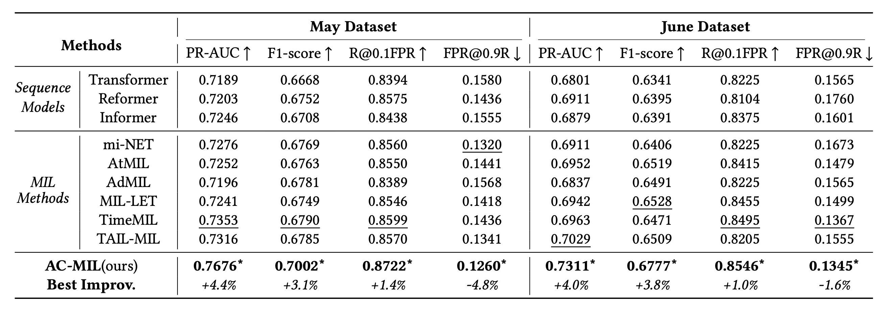
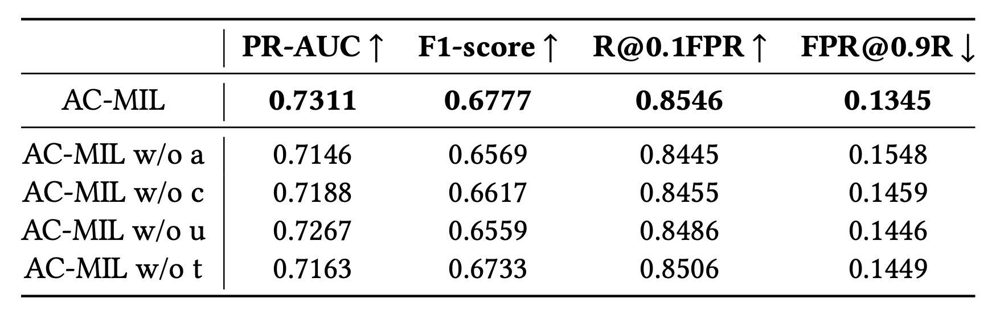
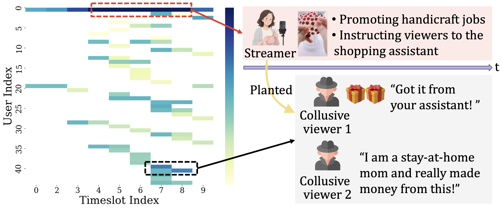
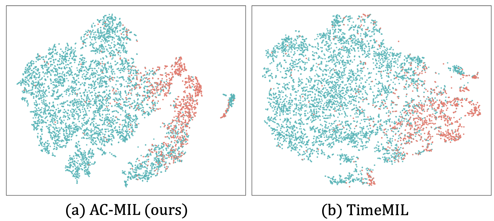
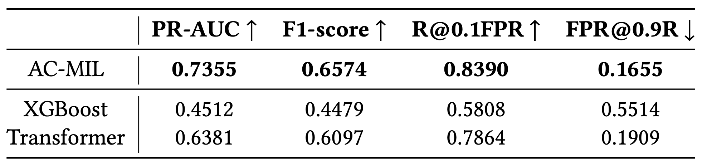

# KDD 2026｜直播间风险，藏在你没注意到的互动里

**论文**：Live or Lie: Action-Aware Capsule Multiple Instance Learning for Risk Assessment in Live Streaming Platforms  
**会议**：KDD 2026
**作者**：Yiran Qiao, Jing Chen, Xiang Ao, Qiwei Zhong, Yang Liu, Qing He  
**单位**：中国科学院计算所 & 字节跳动  

---

## 直播间风险：我们究竟在检测什么？

**直播间**是直播平台的基本单元：主播实时讲解、展示商品或内容，观众通过评论、弹幕、送礼、点赞、加群等方式同步参与。风控任务关注的不是某一条孤立发言，而是**整间房内、多角色、跨时段的行为演化**。

诈骗者常安排水军与主播配合，在大量正常互动中逐步建立信任，再诱导用户站外交易；许多侵害发生在平台外，房间里留下的只是间接、脚本化的证据。因此需要同时建模**谁（用户）**、**何时（时段）**、**做了什么（动作序列）**——这正是本篇用户×时段胶囊建模的出发点。


---

## 开篇：一条「正常」的互动链，可能正在组成诈骗脚本

设想这样一个直播间：

1. 主播热情欢迎：「新来的家人们点点关注」
2. 观众 A 送出小额礼物，吸引注意
3. 观众 B 留言：「我是全职妈妈，真的靠这个赚到钱了」
4. 主播顺势引导：「想了解的私信助理/加粉丝群」

**每一步单独看都正常。** 但按时间顺序、按角色配合组合起来，可能正在执行一条完整的导流诈骗链：

```
建立信任 → 虚假社会证明 → 诱导站外行动
```

直播风控的真正难点不是「有没有敏感词」，而是：

- 风险证据**稀疏**，淹没在长达数十分钟、数百上千条互动里；
- 标注只有**房间级标签**（这间房有没有风险），不知道哪一秒、哪个用户是「坏实例」；
- 诈骗常靠**多人协同**（主播 + 水军），需要同时看「谁」和「何时」。

---

## 问题设定：弱监督下的房间级风险评估

我们把任务形式化为 **多实例学习（Multiple Instance Learning, MIL）** 问题，多实例问题原用于医学影像诊断等问题，即没有细粒度标注，而是给定一个包，包里有很多实例，包的标签是包里至少有一个正样本则包为正，否则为负。此处可理解为：

- **Bag（包）** = 一个直播间
- **Instance（实例）** = 一个 **User × Timeslot 胶囊**：某用户在某段时间窗口内的一系列行为

实验基于 **LiveRisk** 公开基准（May / June 子集）；数据字段与预处理见 [数据集页面](https://huggingface.co/datasets/ByteDance/LiveStreamingRiskControl) 或总稿「数据与评测基准」一节。

---

## 方法：AC-MIL 的五层架构


*图2：AC-MIL 从动作编码到胶囊推理、用户协同与时间演化双视角融合，以及最终的房间级风险预测。*

### （a）Action Field Encoder：先给每条动作「全局上下文」

把所有动作 embedding 拼成序列，加 `[CLS]`，过 **Transformer Encoder**，得到带全局语境的动作表示。

这一步解决什么问题？——单条评论/礼物若脱离上下文，语义不完整；先全局编码，再拆胶囊，能保留「整场直播的叙事背景」。

### （b）Capsule Constructor：拆成 User×Time 胶囊

把时间轴切成 K 个 slot，对每个 `(用户 u, 时段 k)`，把该窗口内的动作序列过 **LSTM**，取最后隐状态作为胶囊向量 `c_{u,k}`。

**为什么不用简单 pooling？**  
直播风险的「实例」不是独立点，而是 **二维 U×T 空间**：同一用户跨时段演化、同一时段多用户协同。TimeMIL 等只按时间聚合，会丢失「哪个用户在哪个时段异常」的结构。

### （c）Relational Capsule Reasoner：四类关系图 + Graph-Aware Attention

在全部胶囊上建图，关系类型 `R = {t, u, r, a}`：

| 关系 | 含义 | 例子 |
|------|------|------|
| **t** 时间 | 相邻时段胶囊相连 | 连续两分钟内_burst 互动 |
| **u** 用户 | 同一用户跨时段相连 | 水军持续发类似话术 |
| **r** 角色 | 主播胶囊 ↔ 观众胶囊 | 主播引导后观众立刻响应 |
| **a** 辅助 | 上述之外的语义相似边 | 跨角色但内容协同的异常 |

语义相似度 × 关系 mask → 自适应邻接矩阵 → **Graph-Aware Transformer** 做胶囊间推理。  
`[CLS]` 的 attention 权重即 **胶囊级可解释性**：哪些 `(用户, 时段)` 对房间风险贡献最大。

### （d）Dual-View Integrator：用户视角 + 时间视角并行

- **用户视角**：每个用户跨时段胶囊 → GRU → 用户 embedding → 注意力聚合（主播有额外 bias）
- **时间视角**：每个时段内多用户胶囊 → 注意力聚合 → 时段 embedding → GRU 沿时间演化

两个视角互补：前者抓「谁一直在配合演戏」，后者抓「哪几分钟进入导流高潮」。

### （e）Cross-Level Risk Decoder：四层信号门控融合

融合 **动作级 / 胶囊级 / 用户级 / 时段级** 四个房间表示，输出最终风险概率。

---

## 实验结果

### 主结果（RQ1）



AC-MIL 在 May / June 上**全面领先**：June PR-AUC **0.7311**，May 达 **0.7676**，较最强基线 TimeMIL 最高提升 **+4.4%**（p < 0.05）。

### 消融实验（RQ2）



去掉 Action Field Encoder（−2.3% PR-AUC）、图关系推理（−1.7%）、用户视角或时间视角，性能均明显下降——串并联架构与双视角融合缺一不可。

### 案例研究（RQ3）



虚假手工兼职场景中，AC-MIL 将高注意力集中在**主播促销时段 + 协同观众簇的连续响应时段**，能给出可执行证据（谁、何时、说了什么），而不只是房间级风险分数。

### 表示可视化（RQ4）



相比 TimeMIL，AC-MIL 的风险房与正常房在表示空间中**分离更明显**，与更高的召回、更低的误报相一致。

### 线上实测（RQ5）



在 07/13–07/14 真实流量上，AC-MIL PR-AUC **0.7355**，R@0.1FPR 比 XGBoost 提升 **+44.46%**，FPR@0.9R 约为 XGBoost 的 **30%**。

---

## 这篇工作贡献了什么？

1. **问题**：首次系统研究「直播间级」风险评估，提出多实例学习形式化  
2. **方法**：AC-MIL 串并联架构，联合建模时间动态与跨用户协同  
3. **落地**：大规模工业数据 SOTA + 胶囊级可解释证据 + 线上验证  
4. **数据**：发布 **LiveRisk** 公开基准（见文末数据集链接）

---

## 与后续两篇的关系

- **Live or Lie** 解决「房间内风险怎么形成、证据在哪」——是整条研究线的**基础表征**
- 下一篇 **Deja Vu in Plots** 在此基础上引入**跨房间历史证据**
- 第三篇 **Outsmarting the Chameleon** 进一步处理**话术演化导致的分布偏移**

---

## 链接

- **本篇论文**（Live or Lie: Action-Aware Capsule Multiple Instance Learning for Risk Assessment in Live Streaming Platforms）：https://dl.acm.org/doi/pdf/10.1145/3770854.3780246
- **数据集**：https://huggingface.co/datasets/ByteDance/LiveStreamingRiskControl
- **代码、合作论文及更多资源**见项目主页：https://qiaoyran.github.io/LiveStreamingRiskAssessment/

---

## 系列导航

- [**总稿：直播间风险研究线**](./总稿-直播间风险研究线.md) — 三篇递进：形成 → 重复 → 演化
- [**分稿2：Deja Vu in Plots**](./分稿2-Deja-Vu-in-Plots.md) — 跨会话检索、LLM 推理、蒸馏部署
- [**分稿3：Outsmarting the Chameleon**](./分稿3-Outsmarting-the-Chameleon.md) — 意图解耦、反事实、OOD 鲁棒
