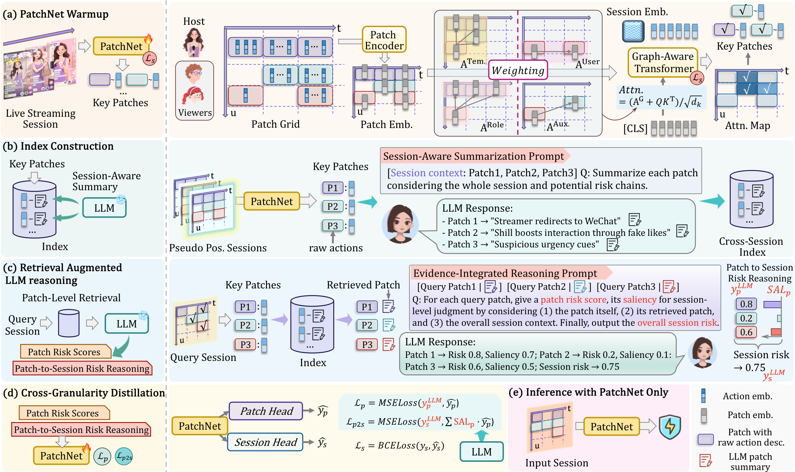
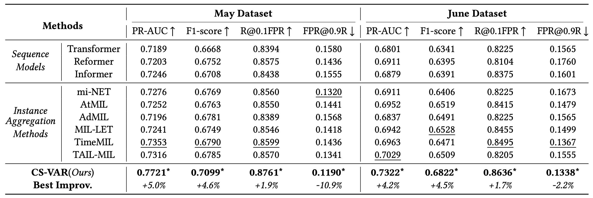
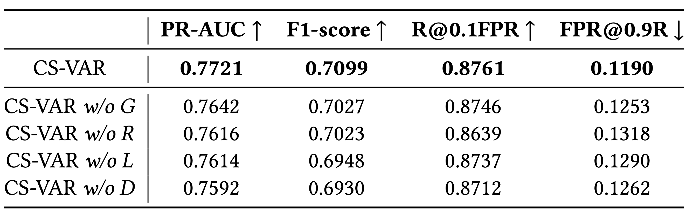
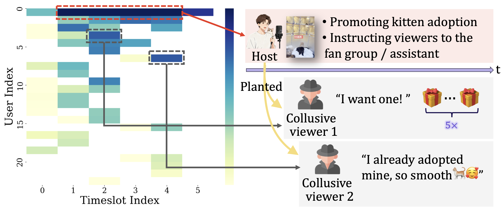
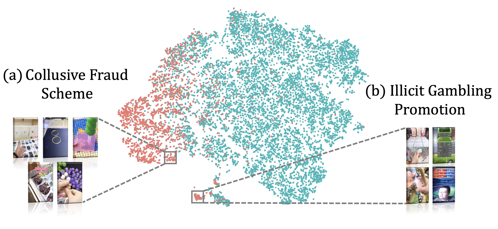
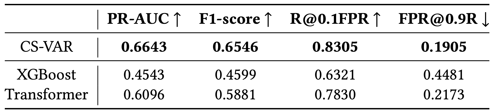

# SIGIR 2026｜不同直播间，为什么总像「同一部风险剧本」？

**论文**：Deja Vu in Plots: Leveraging Cross-Session Evidence with Retrieval-Augmented LLMs for Live Streaming Risk Assessment  
**会议**：SIGIR 2026
**作者**：Yiran Qiao, Xiang Ao, Jing Chen, Yang Liu, Qiwei Zhong, Qing He  
**单位**：中国科学院计算所 & 字节跳动  

---

## 开篇：「这剧情，我是不是在哪见过？」

直播间 A 大推「日结兼职」，直播间 B 卖「超低价手机」——品类完全不同。

但如果你只看**行为演化链条**：

| 阶段 | 兼职诈骗房 | 低价手机房 |
|------|------------|------------|
| 1 | 宣传高回报兼职 | 宣传超低价格 |
| 2 | 观众咨询细节 | 观众询价 |
| 3 | 水军晒「已赚到」 | 水军晒「已买到」 |
| 4 | 制造名额紧张 | 制造库存紧张 |
| 5 | 引导加微信/私信 | 引导加微信/私信 |

表面话术不同，**剧本结构几乎一致**。

平台侧的真实约束是：

- 只有**会话级标签**（这间直播有没有风险），几乎没有 patch 级人工标注；
- 每秒涌入大量新直播间，**不可能**让审核员实时翻阅历史案例；
- 纯大模型推理能力强，但**成本高、上下文有限**，无法对每个直播间直接调用。

**核心问题**：既然恶意剧本会跨房间重演，当前直播间能否「回忆」历史相似证据，并把它变成可部署的实时检测能力？

---

## 方法总览：CS-VAR 五阶段流水线

我们提出 **CS-VAR（Cross-Session Evidence-Aware Retrieval-Augmented Detector）**。



*图1：PatchNet 预热 → 跨会话索引 → LLM 推理 → 蒸馏 → 线上仅 PatchNet 推理。*

```
(a) PatchNet Warm-up     → 学 patch 嵌入 + 找关键片段
(b) Index Construction   → LLM 写跨会话语义摘要，建 FAISS 索引
(c) RAG + LLM Reasoning  → 检索历史证据，联合推理
(d) Cross-Granularity Distillation → 蒸馏回 PatchNet
(e) Inference            → 线上只用 PatchNet，实时出分
```

**设计哲学**：训练阶段让 LLM「带历史案例教」，部署阶段让小模型「独立跑」。

---

## 第一步：把直播间表示成 Patch Grid

延续 Live or Lie 的会话建模，将直播间离散为 **User × Timeslot Patch Grid**——每个 patch 是某用户在某时段内的有序动作子序列。

**弱监督目标**：给定会话标签 `y_s ∈ {0,1}`，学习 `f: 会话 → [0,1]` 风险概率，同时输出 patch 级信号。

---

## 第二步：PatchNet——轻量骨干 + 四类关系图

### Patch Encoder（两阶段）

1. 动作序列 → Transformer 编码 → 上下文动作 token `h_i`
2. 按 `(用户, 时段)` 分组 → 每组过 LSTM → patch embedding `p_{u,k}`

### Relational Graph

在 patch 节点上建四类邻接：**时间 t、用户 u、角色 r（主播-观众）、辅助 a**：

```
A^t: 相邻时段 + 语义相似
A^u: 同一用户跨时段
A^r: 主播 patch ↔ 观众 patch
A^a: 剩余语义相似（补漏协同异常）
```

加权融合 → **Graph-Aware Transformer** → `[CLS]` 作为会话 embedding → MLP 输出 `ŷ_s`。

### Warm-up 训练

仅用会话级 **BCE 损失**训练 PatchNet，直到验证集性能开始下降即停止（early stopping）。  
此阶段目标：

1. 学到**可检索**的 patch 向量空间
2. 通过 `[CLS]` 对 patch 的 attention，找出会话内**关键片段**

---

## 第三步：建跨会话索引（LLM 写摘要，不是存原文）

对 PatchNet 预测为**正例**的会话，按 attention 选关键 patch：

| 角色 | 保留数量 | 原因 |
|------|----------|------|
| 主播 | Top-5 | 驱动叙事，需覆盖多样话术 |
| 观众 | Top-3 | 行为碎片化，控制噪声 |

**关键设计**：不是把 patch 原文直接塞进索引，而是把**同一会话内多个 patch 片段一起**交给 LLM，生成 **session-aware summary**——既描述表面事件，也揭示片段在整条风险链中的位置。

索引条目：`(patch embedding, LLM 摘要, session id 等元数据)` → 存入 **FAISS**（cosine 相似度）。

相比传统 RAG 索引「verbatim 文本块」，我们的索引同时具备：

- PatchNet 的**风险敏感嵌入**（检索不只靠语义，还带判别偏置）
- LLM 的**跨片段语义抽象**（看懂「这是背书环节」而不只是「有人说赚到了」）

---

## 第四步：检索增强 LLM 推理

对每个训练会话的关键 patch `k`：

1. 用 `p_k` 在索引中检索 **Top-1 跨会话邻居**（**排除同会话**，避免 trivial match）
2. 组装 prompt：`(当前 patch, 检索到的历史 patch 摘要)` 成对呈现
3. LLM（实验用 **doubao-1.5-pro-32k**）输出：
   - **patch 级**风险分 `y^LLM_k` + 显著性 `SAL_k`
   - **session 级**风险分 `y^LLM_s`

LLM 的任务不是背答案，而是：**在当前局部证据 + 历史相似剧本的对照下，判断这段行为在风险链中的位置。**

---

## 第五步：跨粒度蒸馏——把 LLM 的「推理链」压进 PatchNet

总损失：

```
L = L_s + β·L_p + δ·L_p2s
```

| 项 | 含义 |
|----|------|
| `L_s` | 会话级 BCE，锚定真实标签 |
| `L_p` | patch 预测 `ŷ_k` 拟合 LLM 的 `y^LLM_k` |
| `L_p2s` | 用 LLM 显著性加权聚合 patch 预测，拟合 `y^LLM_s` |

**推理阶段**：只用蒸馏后的 PatchNet，**无需检索、无需调 LLM** → 满足实时风控延迟要求。


---

## 实验结果

### 主结果（RQ1）



CS-VAR 在 May / June 上均为最优：PR-AUC **0.7721 / 0.7322**，较最强 MIL 基线提升 **+5.0% / +4.2%**，May 上 FPR@0.9R 相对降低 **10.9%**。跨会话证据带来传统池化无法表达的增益。

### 消融实验（RQ2）



去掉图注意力、跨会话检索、LLM 结构化推理或蒸馏，性能均下滑；四阶段**缺一不可**——仅靠 embedding 相似度平均无法替代 LLM 推理。

### 案例研究（RQ3）



即便与典型「兼职」「手机」品类不同，CS-VAR 仍能识别**STAGED 说服 + 工程化互动**结构（低价领养、水军送礼、虚假证言、引导加群等）。

### 表示分析（RQ4）



会话表示自动形成簇：协同诈骗（假抽奖、低价货、虚假兼职）与赌博推广（盲盒、体育博彩等）——表面卖点不同，**互动剧本结构相近**，印证跨会话「既视感」。

### 线上部署（RQ5）



12/18–12/19 真实流量上，CS-VAR R@0.1FPR **0.8305**，比 XGBoost 高出 **+31.4 个百分点**，误报率降至约 **43%**。

---

## 为什么不用「纯 LLM」或「纯小模型」？

| 方案 | 问题 |
|------|------|
| 纯 LLM 全量推理 | 延迟高、成本高；长且噪的直播序列易撑爆上下文 |
| 纯 PatchNet / MIL | 只见当前会话，缺少「这类剧本通常怎么收场」的先验 |
| **CS-VAR** | 训练：LLM + 检索做「教师」；部署：PatchNet 做「学生」 |

这是工业场景里很典型的一条路：**用大模型的理解力，换小模型的速度与稳定性。**

---

## 与前后工作的关系

- **前置**：Live or Lie（AC-MIL）解决房间内局部信号与协同关系
- **本篇**：在 patch 粒度上引入**跨会话检索 + LLM 推理 + 蒸馏**
- **后续**：Outsmarting the Chameleon 处理话术换皮导致的**战术 OOD**

---

## 链接

- **本篇论文**（Deja Vu in Plots: Leveraging Cross-Session Evidence with Retrieval-Augmented LLMs for Live Streaming Risk Assessment）：https://arxiv.org/pdf/2601.16027
- **数据集**：https://huggingface.co/datasets/ByteDance/LiveStreamingRiskControl
- **代码、合作论文及更多资源**见项目主页：https://qiaoyran.github.io/LiveStreamingRiskAssessment/

---

## 系列导航

- [**总稿：直播间风险研究线**](./总稿-直播间风险研究线.md) — 三篇递进：形成 → 重复 → 演化
- [**分稿1：Live or Lie**](./分稿1-Live-or-Lie.md) — 弱监督、胶囊 MIL、可解释证据
- [**分稿3：Outsmarting the Chameleon**](./分稿3-Outsmarting-the-Chameleon.md) — 意图解耦、反事实、OOD 鲁棒
