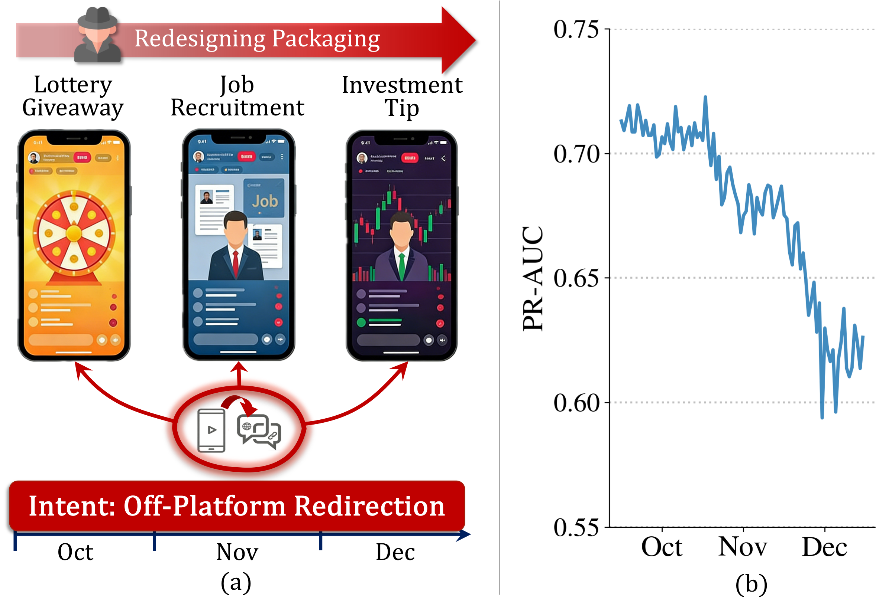
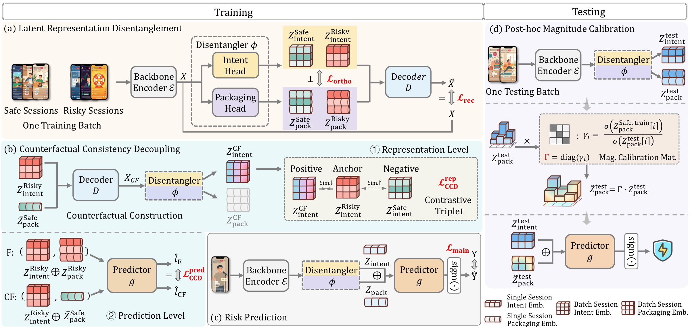
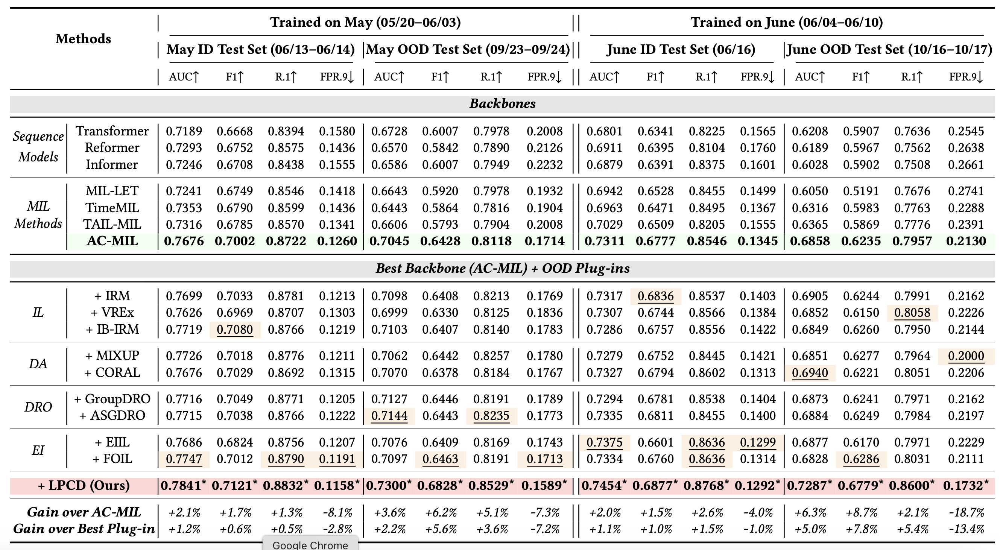
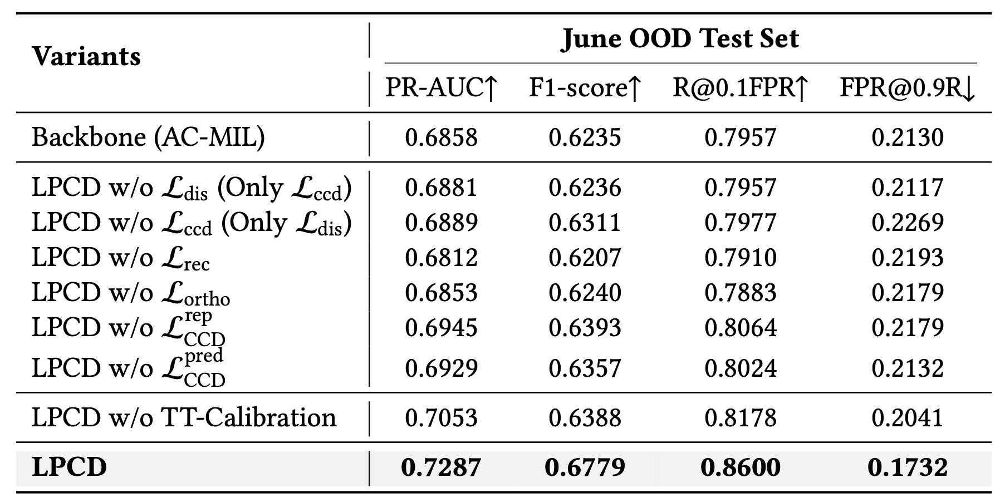
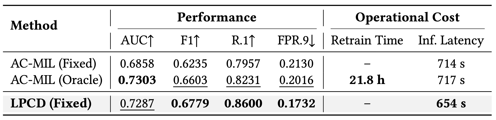
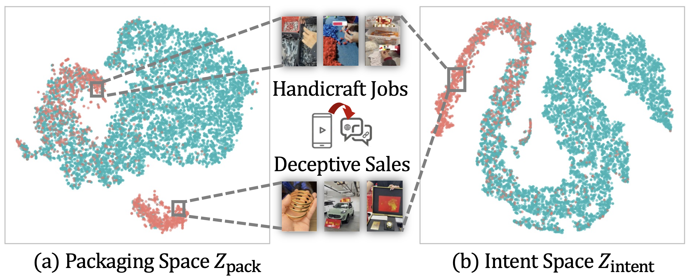
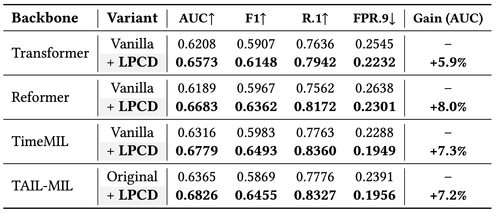
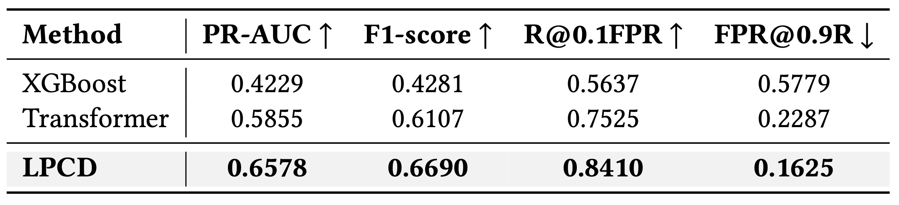

# KDD 2026｜跟上变招：直播话术天天变，怎么跟得上「变色龙」？

**论文**：Outsmarting the Chameleon: Counterfactual Decoupling for Tactical OOD Shifts  
**会议**：KDD 2026
**作者**：Yiran Qiao, Jing Chen, Jiaqi Xu, Yang Liu, Qiwei Zhong, Xiang Ao  
**单位**：中国科学院计算所 & 字节跳动  

---

## 开篇：同样的恶意意图，可以换无数张「皮」

直播风控里有一类特别难缠的漂移，不是用户画像变了，也不是季节性波动——而是**攻击者在主动改剧本**。

同样为了 **导流站外**，话术可以不断翻新：

| 时期 | 表面包装（Packaging） | 底层意图（Intent） |
|------|----------------------|-------------------|
| 早期 | 「扫码领红包」 | 诱导离开平台 |
| 中期 | 「日结兼职、在家手工」 | 诱导离开平台 |
| 后期 | 「投资交流群、内幕消息」 | 诱导离开平台 |

另一类常见意图是 **站内欺诈变现**（虚假销售、收款后不发货等），同样会不断换品类话术。

论文将这种现象定义为 **战术分布偏移（Tactical OOD）**：

- 分布变的是**叙事包装、互动节奏、协同方式**
- 不变的是**恶意目标本身**
- 攻击者会**策略性地**让包装与意图紧耦合，专门骗过「记表面套路」的模型



*图1：(a) 攻击者保持恶意意图不变、持续更换叙事包装；(b) 2025.10–12 生产风控模型 PR-AUC 明显衰减。*

---

## 现有 OOD 方法为什么不够用？

| 路线 | 局限 |
|------|------|
| 环境不变学习（IRM 等） | 需要环境标签；直播战术连续演化，难划边界 |
| 数据增强 / 对齐（Mixup、CORAL） | 假设漂移较「被动」，难应对对抗性改剧本 |
| 分布鲁棒优化（GroupDRO） | 同样依赖环境划分 |
| 原始输入反事实 | 直播是多模态高维交互，很难在原始空间做「只改包装不改意图」的干预 |

我们需要：**在潜空间分离「会变」与「不变」，并对「不变」做反事实约束。**

---

## 方法：LPCD 四模块

**LPCD（Latent-Predictive Counterfactual Decoupling）** 是挂在骨干网络（如 AC-MIL）上的 **plug-in 框架**。



*图2：LPCD 训练阶段包含潜空间解耦、反事实一致性约束与风险预测；测试阶段辅以无参数幅度校准。*

### （a）Latent Representation Disentanglement：拆成 Intent + Packaging

会话 embedding `x = E(S)` 过双分支 MLP：

```
h = f_shared(x)
z_intent = f_intent(h)    # 恶意意图因子
z_pack   = f_pack(h)      # 表面包装因子
```

配套约束：

- **重建损失 L_rec**：`D(z_intent, z_pack)` 重构 x，防止信息丢失
- **正交损失 L_ortho**：惩罚 intent 与 packaging 的线性相关，减少「串味」

### （b）Counterfactual Consistency Decoupling（CCD）：「只改包装，不改意图」

对训练 batch 中的**风险会话**：

1. 取安全会话 packaging 的 batch 均值 `z̄_pack^safe` 作为「良性包装原型」
2. 构造反事实：`x_CF = D(z_intent^risky, z̄_pack^safe)`  
   → 语义：**同一个恶意意图，若换上普通良性包装，应如何表现**
3. 反事实再编码得 `z_intent^CF`，用对比损失拉近 `z_intent^risky` 与 `z_intent^CF`

同时在**预测层**也做反事实一致性（`L_CCD^pred`），防止表示解耦了、分类头仍追表面特征。

### （c）Risk Prediction：解耦后联合预测

intent + packaging 因子送入风险预测头，在标准会话标签下训练。

### （d）Post-hoc Magnitude Calibration：测试时「最后一厘米」

战术演化常带来 packaging 统计量的幅度漂移。LPCD 在推理前对 packaging 向量做**无参数幅度校准**（默认 V0：按维度校准），不更新模型权重，适应新环境。

消融显示：去掉校准，June OOD 上 PR-AUC 从 **0.7287 → 0.7053**（−3.2%）。

---

## 直观理解：反事实在逼模型学什么？

想象两个风险会话：

- 会话 1：手工兼职包装 → 导流
- 会话 2：低价手机包装 → 导流

观测上，它们「看起来」差很多。  
反事实问的是：**如果把会话 1 的包装换成「普通良性直播」的平均水平，意图表征是否应该稳定？**

若模型只因「手工兼职」关键词就判风险，反事实一致性会惩罚它；  
若模型跟的是「导流意图」，则在包装干预下仍保持一致——这才是我们想要的**因果稳定核心**。

论文 Case Study 的 t-SNE 可视化（见下文 RQ4）表明：Packaging 空间按表面战术分列，Intent 空间则将对齐同一恶意意图的会话聚在一起。

---

## 实验设置：用「时间」构造战术 OOD

沿用 **LiveRisk** 的 May / June 子集，并按时间切出 **战术 OOD 测试集**（与训练相隔数月，模拟话术翻新）：

| 数据集 | 训练 | ID 测试 | **战术 OOD 测试** |
|--------|------|---------|-------------------|
| May | 05/20–06/03 | 06/13–06/14 | **09/23–09/24**（隔 3+ 月） |
| June | 06/04–06/10 | 06/16 | **10/16–10/17**（隔 4 月） |

**骨干**：AC-MIL（亦可 plug 到序列模型、MIL 模型等）

**对比 OOD 插件**（论文四类范式）：**不变学习（Invariant Learning, IL）**、**数据增强与对齐（Data Augmentation, DA）**、**分布鲁棒优化（Distribution Robust Optimization, DRO）**、**环境推断（Environment Inference, EI）**——各含 IRM/VREx、Mixup/CORAL、GroupDRO、EIIL/FOIL 等代表方法

**指标**：PR-AUC、F1、R@0.1FPR、FPR@0.9R（贴近工业「高召回 + 控误报」）

---

## 实验结果

### 主结果（RQ1）



LPCD 在 May / June 的 **ID 与 OOD** 四套设定上四项指标**全线最优**。战术 OOD 下优势放大：May OOD 上 PR-AUC 比 AC-MIL **+3.6%**、比最强 OOD 插件 **+2.2%**；June OOD 上 FPR@0.9R 相对降低 **18.7%**。

### 消融实验（RQ2）



去掉解耦损失、CCD 或测试时校准，June OOD 性能均明显回落（如去掉校准 PR-AUC **0.7287 → 0.7053**）。解耦与反事实**相互依赖**，缺一不可。

### 效率对比（RQ3）



June OOD 上，**4 个月未重训**的 LPCD（PR-AUC **0.7287**）接近用最新数据重训的 Oracle（**0.7303**），却在 F1、R@0.1FPR、FPR@0.9R 等运营指标上全面更好，且推理更快、**零重训成本**。

### 案例研究（RQ4）



「虚假手工兼职」与「虚假低价销售」在 Packaging 空间分列两簇，在 Intent 空间却坍缩到同一流形——共享 **站外导流意图**，解释 LPCD 对未见包装的鲁棒性。

### 骨干泛化（RQ5）



LPCD plug 到 Transformer、Reformer、Informer、TimeMIL 等骨干，PR-AUC 相对提升 **+5.9% ~ +8.0%**，为**通用 OOD 插件**，不绑死 AC-MIL。

### 线上部署（RQ6）



真实生产流量上，LPCD 显著优于既有部署模型，验证战术演化场景下的落地价值。

---

## 两类典型战术案例

**① 虚假手工兼职（Handicraft Jobs）**  
包装：高回报居家兼职、培训材料费  
意图：off-platform redirection

**② 虚假低价销售（Deceptive Sales）**  
包装：名牌超低价、限时抢购  
意图：on-platform deceptive monetization 或站外交易

在 Packaging 空间它们离得很远；在 Intent 空间它们应当靠近——LPCD 学到的正是这种结构。

---

## 三篇工作如何拼成完整方案？

```
Live or Lie (AC-MIL)
  → 房间内：谁×何时×做了什么

Deja Vu in Plots (CS-VAR)
  → 跨房间：历史相似剧本作证据

Outsmarting the Chameleon (LPCD)
  → 跨时间：话术换皮时跟意图、不跟包装
```

工业落地可以是：**AC-MIL做实时打分 → CS-VAR 蒸馏模型补充跨会话模式 → LPCD 作为部署后长期保鲜的 OOD 插件。**

---

## 链接

- **本篇论文**（Outsmarting the Chameleon: Counterfactual Decoupling for Tactical OOD Shifts）：https://arxiv.org/pdf/2606.02946
- **数据集**：https://huggingface.co/datasets/ByteDance/LiveStreamingRiskControl
- **代码、系列论文及更多资源**见项目主页：https://qiaoyran.github.io/LiveStreamingRiskAssessment/

---

## 系列导航

- [**总稿：直播风控三部曲**](./总稿-直播间风险研究线.md) — 从「藏」到「抄」到「变」
- [**分稿1：看见风险（Live or Lie）**](./分稿1-Live-or-Lie.md) — 弱监督、胶囊 MIL、可解释证据
- [**分稿2：认出剧本（Deja Vu in Plots）**](./分稿2-Deja-Vu-in-Plots.md) — 跨会话检索、LLM 推理、蒸馏部署
