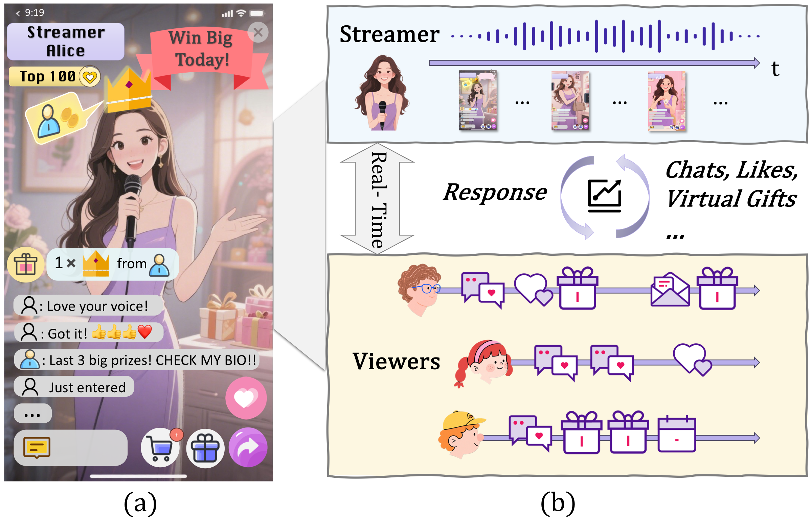
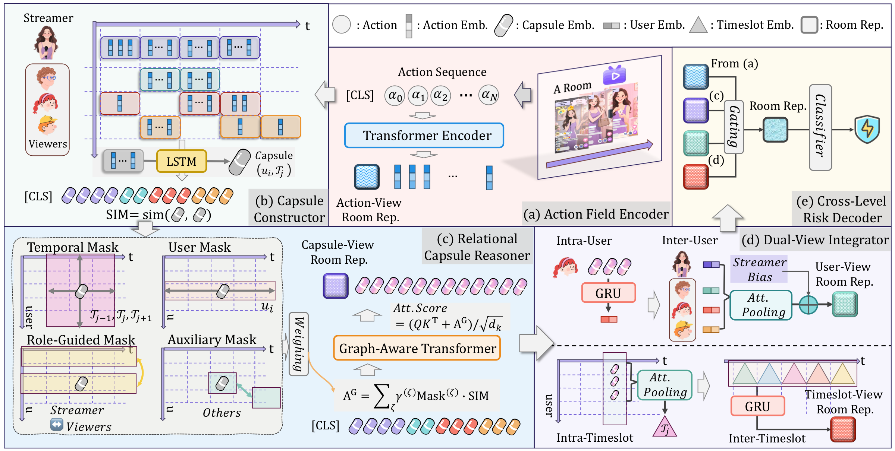
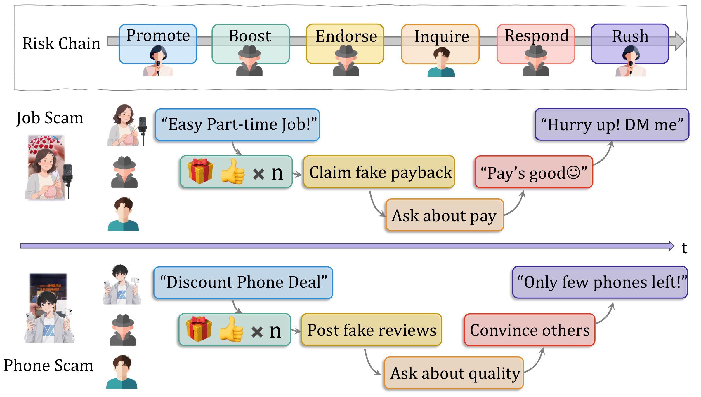

# KDD×2 + SIGIR｜直播间风险如何形成、重复与演化？

**作者**：Yiran Qiao 
**项目主页**：https://qiaoyran.github.io/LiveStreamingRiskAssessment/

---


*封面图：理解行为 → 发现模式 → 应对演化。*

---

## 直播间是什么？

**直播间**是直播平台上的基本服务单元：一位**主播**实时输出语音、画面与营销内容，大量**观众**通过评论、弹幕、点赞、打赏、加群、连麦等方式同步参与，形成高频率、多角色、长时间连续的互动流。

和短视频、图文不同，直播风控看的不是「一条内容」，而是**整个直播间内所有人、在一段时间内共同写出的行为序列**。风险往往不会以单条违规话术出现，而是散落在：

- 主播的多轮引导与话术设计；
- 部分观众的异常配合（如水军送礼、虚假好评）；
- 正常观众与风险行为交织的行为序列。

真实诈骗还常把最终侵害发生在**站外**（加微信、跳转链接等），直播间里留下的往往只是间接、脚本化的互动证据——因此需要理解「谁、在什么时段、做了什么」，而不是只做关键词匹配。



*图1（Live or Lie, Figure 1）：直播间示意图。（a）主播持续输出语音与画面，界面呈现评论、打赏、点赞等多种互动入口；（b）观众通过弹幕、礼物、点赞等与主播实时互动，主播亦会回应观众行为。论文借此说明：风控对象是整间房的实时互动流，而非孤立内容——任一动作单独看都可能正常，按角色与时间组合后却可能构成隐蔽风险链。*

---

直播已经从娱乐入口，演化为融合社交、内容消费和电商的重要生态。抖音等平台每天承载海量实时互动，但也伴随着诈骗、违规营销、诱导导流等风险。
****
和传统「审一条评论、封一个视频」的内容审核不同，**直播风控面对的是整场互动演化出来的风险**：

- 单条行为往往看起来完全正常，但风险证据散落在主播、观众、水军之间；
- 相似套路会在不同直播间反复上演；
- 攻击者还会不断改套路、改脚本，让旧模型迅速失效。

围绕下列三个层次，我们形成了一条递进的研究线，并分别发表于 **KDD 2026（两篇）** 与 **SIGIR 2026**：

| 层次 | 核心问题 | 论文（全称） |
|------|----------|--------------|
| 房间内 | 风险信号藏在哪里？ | **Live or Lie: Action-Aware Capsule Multiple Instance Learning for Risk Assessment in Live Streaming Platforms**（KDD 2026） |
| 跨房间 | 相似套路如何利用？ | **Deja Vu in Plots: Leveraging Cross-Session Evidence with Retrieval-Augmented LLMs for Live Streaming Risk Assessment**（SIGIR 2026） |
| 动态演化 | 套路变了怎么办？ | **Outsmarting the Chameleon: Counterfactual Decoupling for Tactical OOD Shifts**（KDD 2026） |

---

## 数据与评测基准（LiveRisk）

三篇论文基于**抖音直播**工业日志，并开源脱敏后统一基准 **LiveRisk**（[HuggingFace](https://huggingface.co/datasets/ByteDance/LiveStreamingRiskControl)），便于社区在相同设定下复现与对比。

**任务怎么标？**  
只有**会话级（直播间级）**标签：这场直播有没有风险（0/1）。没有「哪一秒、哪条弹幕」的细粒度标注——这正是三篇工作都要面对的**弱监督**设定。

**每条样本是什么？**  
一场直播前 **30 分钟**内的多用户行为序列，按 **100 秒**切为 timeslot，保留最活跃的 **Top-50** 观众。行为类型包括：观众进房、评论/弹幕、送礼、点赞、分享、加群等；主播侧含开播、**ASR 语音转写**、**OCR 画面文字**等。

**两条主数据子集（May / June）**  

| 子集 | 训练时段 | ID 测试 | 规模（训练 / ID 测试） | 场均行为 · 用户 |
|------|----------|---------|------------------------|-----------------|
| **May** | 2025/05/20 – 06/03 | 2025/06/13 – 06/14 | 176,347 / 22,462 场 | ≈709 条 · ≈35 人 |
| **June** | 2025/06/04 – 06/10 | 2025/06/16 | 79,552 / 10,967 场 | ≈700 条 · ≈36 人 |

工业风控惯例：**全部风险样本保留**，正常样本 **1:10** 下采样（正类约占 9%）。

**和第三篇 OOD 评测的关系**  
Live or Lie、Deja Vu 主要在上述 **ID 测试集**上报告结果。Outsmarting the Chameleon 在此基础上增加**按时间切分的战术 OOD 测试集**——与训练相隔数月，模拟话术翻新后的分布偏移（May OOD：2025/09/23–09/24；June OOD：2025/10/16–10/17）。数据同源、划分不同，而非另起一套无关数据。

---

## 一、Live or Lie: Action-Aware Capsule Multiple Instance Learning for Risk Assessment in Live Streaming Platforms（KDD 2026）

直播诈骗很少一句话暴露。更常见的是多步脚本：主播持续引导、水军协同互动、逐步建立信任，再诱导用户离开平台。

单独看「主播欢迎观众」「有人送礼」「有人说赚到了」——都正常；  
放在完整上下文里，却可能形成：**建立信任 → 虚假背书 → 诱导行动**。

若把整个直播间压成一个向量，这些局部信号很容易被海量正常互动稀释。

我们提出 **AC-MIL（Action-aware Capsule MIL）**：把直播间风控建模为多实例学习（MIL）问题，将直播间内多主体复杂行为拆成 **User × Timeslot** 行为胶囊作为单实例，用图感知关系推理 + 双视角融合，在**只有房间级标签的弱监督**下做风险检测，并能指出「哪些用户、哪段时间、哪些行为」可能支撑风险判断。



*图2（Live or Lie, Figure 2）：AC-MIL 整体框架——动作场编码、User×Timeslot 胶囊、关系推理、双视角融合与房间级风险解码。*

在抖音大规模工业数据上，AC-MIL 相比最强基线，PR-AUC 提升最高达 **+4.4%（May）/ +4.0%（June）**，并显著降低高召回下的误报率。

**进一步阅读** → 见分稿《Live or Lie: Action-Aware Capsule MIL…》

---

## 二、Deja Vu in Plots: Leveraging Cross-Session Evidence with Retrieval-Augmented LLMs for Live Streaming Risk Assessment（SIGIR 2026）

恶意脚本常在许多直播间里**反复上演**：表面话术、带货品类可以完全不同，但行为演化的「剧情结构」却高度相似。



*图2（Deja Vu, Figure 1）：两种诈骗场景下的行为 patch 链示意——**兼职骗局**（part-time job scam）与**低价手机骗局**（cheap phone scam）。图中标注主播、典型水军（shills）与潜在受害者（victims-to-be）等角色。尽管表面语境截然不同，两者都遵循几乎相同的递进：**宣传引流 → 用户咨询 → 水军背书 → 制造紧迫感 → 催促行动**。这正是「既视感」：当前房间能否对照历史相似剧本做判断？*

例如直播间 A（兼职赚钱）与 B（低价手机），演化都可以概括为：

```
宣传引流 → 用户咨询 → 水军背书 → 制造紧迫感 → 导流站外
```

既然套路会重复，当前房间能否调用历史相似案例？

我们提出 **CS-VAR**：小模型定位关键行为片段 → 跨会话索引存储 LLM 语义摘要 → LLM 联合推理 → 蒸馏回小模型。**线上推理只需小模型，无需每次检索 + 调大模型。**


*图3（Deja Vu, Figure 2）：CS-VAR 整体流程——小模型预热、跨会话索引、检索增强 LLM 推理、跨粒度蒸馏，部署时仅运行小模型。*

在 May / June 数据集上，CS-VAR 的 PR-AUC 达到 **0.7721 / 0.7322**，比最强基线分别提升 **5.0% / 4.2%**；线上实测也显著优于既有 XGBoost 与 Transformer 部署模型。

**进一步阅读** → 见分稿《Deja Vu in Plots: Retrieval-Augmented LLMs…》

---

## 三、Outsmarting the Chameleon: Counterfactual Decoupling for Tactical OOD Shifts（KDD 2026）

重复套路不是全部。攻击者会**主动改剧本**：同样为了导流站外，包装可以从「扫码领红包」换成「兼职赚钱」再换成「投资交流群」——恶意意图不变，表面叙事像变色龙一样换色。


*图4（Chameleon, Figure 1）：（a）攻击者维持**不变的恶意意图**（如 off-platform redirection，导流站外），但持续重新设计**易变的叙事包装**（narrative packaging）以规避检测——抽奖福利、招聘兼职、投资荐股等只是不同「外壳」；（b）2025 年 10–12 月**生产环境**风控模型 PR-AUC 随时间明显下滑，说明只记住历史套路的模型，在话术翻新后会迅速失效。我们将这类偏移称为**战术分布偏移（Tactical OOD）**：分布变的是包装与互动节奏，不变的是底层风险逻辑。*

我们提出 **LPCD（Latent-Predictive Counterfactual Decoupling）**：在潜空间分离 **Intent（恶意意图）** 与 **Packaging（表面包装）**，用反事实一致性约束「包装变了、意图不变」，并配合测试时无参数校准。


*图5（Chameleon, Figure 2）：LPCD 训练阶段解耦意图/包装并施加反事实一致性；推理阶段辅以幅度校准，适应战术演化。*

在 June OOD 测试集上，LPCD 的 PR-AUC 达 **0.7287**，比 AC-MIL 骨干提升 **6.3%**；在 90% 召回下，误报率相对降低 **18.7%**。一个训练于 4 个月前的固定模型，性能可接近「用最新数据重训」的 Oracle，且无需重训成本。

**进一步阅读** → 见分稿《Outsmarting the Chameleon: Counterfactual Decoupling…》

---

## 总结：看见 → 回忆 → 适应

直播风险不是静态分类题，而是**不断形成、重复和演化**的过程：

```
房间内局部信号（AC-MIL）
        ↓
跨房间套路证据（CS-VAR）
        ↓
战术演化鲁棒性（LPCD）
```

三篇工作基于同一 **LiveRisk** 基准，在统一的弱监督设定下递进展开方法。

---

## 链接

- **Live or Lie: Action-Aware Capsule Multiple Instance Learning for Risk Assessment in Live Streaming Platforms**（KDD 2026）：https://dl.acm.org/doi/pdf/10.1145/3770854.3780246
- **Deja Vu in Plots: Leveraging Cross-Session Evidence with Retrieval-Augmented LLMs for Live Streaming Risk Assessment**（SIGIR 2026）：https://arxiv.org/pdf/2601.16027
- **Outsmarting the Chameleon: Counterfactual Decoupling for Tactical OOD Shifts**（KDD 2026）：https://arxiv.org/pdf/2606.02946
- **数据集**（LiveRisk）：https://huggingface.co/datasets/ByteDance/LiveStreamingRiskControl
- **代码等更多资源**见项目主页：https://qiaoyran.github.io/LiveStreamingRiskAssessment/

---

## 系列导航

- [**分稿1：Live or Lie**](./分稿1-Live-or-Lie.md) — 弱监督、胶囊 MIL、可解释证据
- [**分稿2：Deja Vu in Plots**](./分稿2-Deja-Vu-in-Plots.md) — 跨会话检索、LLM 推理、蒸馏部署
- [**分稿3：Outsmarting the Chameleon**](./分稿3-Outsmarting-the-Chameleon.md) — 意图解耦、反事实、OOD 鲁棒
